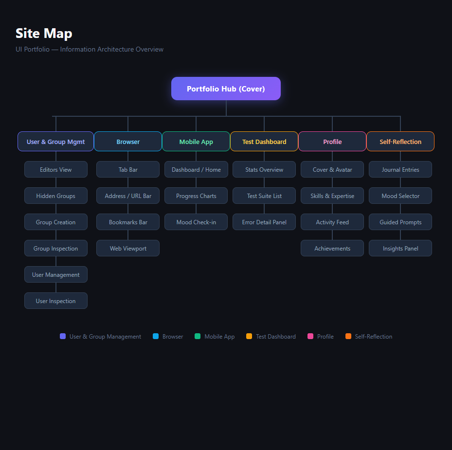
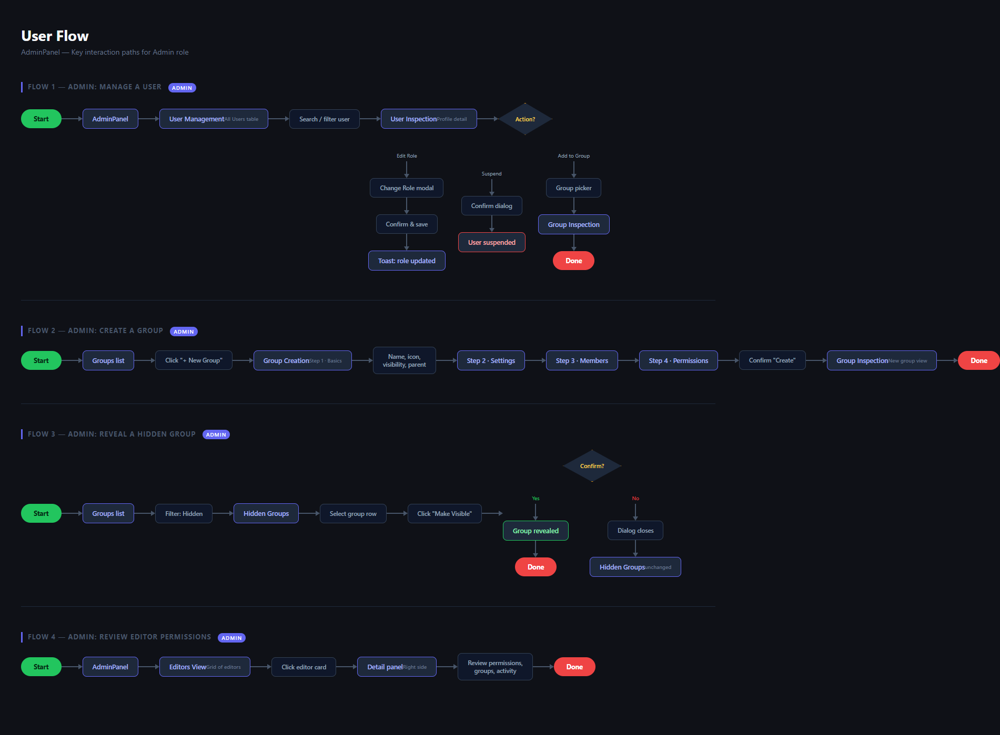
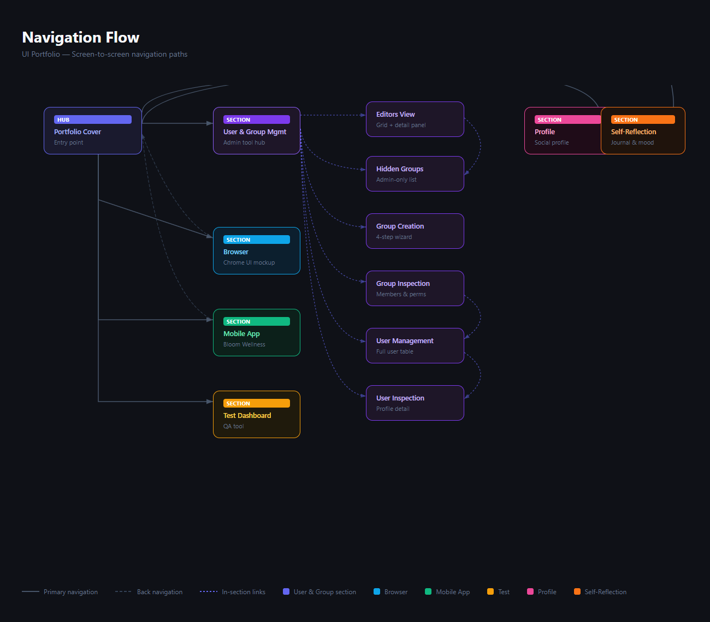

# AdminPanel

A focused UI case study of an enterprise admin panel — covering user management, editors, group hierarchies, permissions, hidden groups, and visibility controls. All screens are captured into a single Figma file alongside full UX documentation (site map, user flows, navigation flow).

---

## Overview

This project demonstrates end-to-end UI design thinking for a complex admin tool — from information architecture through interaction flows to pixel-level screen design. The focus is on role-based access control, group management, and editor oversight within an enterprise content platform.

**[▶ Interactive Prototype](http://localhost:8765/prototype.html)** — click through 4 flows (Admin: Manage a User, Create a Group, Reveal Hidden Group, Editor: Check Permissions). Serve locally first — see [Live Demo](#live-demo) below.

---

## Key Features

### User & Group Management Tool
A full-featured admin panel for managing editors, groups, and permissions inside a content platform.

- **Editors View** — Grid of editor cards with role/status filters and a slide-in detail panel showing permissions, group memberships, and recent activity
- **Hidden Groups** — Admin-only list of visibility-restricted groups with access rules, audit controls, and a one-click reveal workflow
- **Group Creation** — 4-step wizard (Basics → Settings → Members → Permissions) with icon picker, colour selector, parent group dropdown, and visibility radio options
- **Group Inspection** — Group hero strip with live stats, tabbed members table, sub-group cards, and inherited permission toggles
- **User Management** — Paginated user table with 5 stat cards (total / active / pending / suspended / MFA %), filter chips, bulk action bar, and per-row quick actions
- **User Inspection** — 3-column user profile: identity + active sessions | effective permissions grid + group memberships | 30-day audit log timeline

### Browser
macOS-style browser chrome mockup with tab bar (5 tabs), address bar with security indicator, bookmarks bar, and a fully rendered fictional website (NovaSphere) inside the viewport.

### Test Dashboard
Dark-theme QA tool for a software team:
- Stats row: 128 tests · 76 passed · 4 failed · 48 skipped
- Test suite list with pass/fail/skip status rows
- Expandable error detail panel with stack trace and diff view

---

## Live Demo

Serve locally with Node.js (no install required):

```bash
node -e "
const http=require('http'),fs=require('fs'),path=require('path');
http.createServer((req,res)=>{
  const f=path.join('.',req.url==='/'?'/cover.html':req.url);
  fs.readFile(f,(e,d)=>{
    if(e){res.writeHead(404);res.end();}
    else{res.writeHead(200,{'Content-Type':req.url.endsWith('.html')?'text/html':'text/plain'});res.end(d);}
  });
}).listen(8765,()=>console.log('Open http://localhost:8765'));
"
```

Then open **http://localhost:8765** — this loads `cover.html`, the portfolio hub with navigation to all screens.

| Screen | URL |
|---|---|
| Portfolio Cover | `/cover.html` |
| Editors View | `/editors-view.html` |
| Hidden Groups | `/hidden-groups.html` |
| Group Creation | `/group-creation.html` |
| Group Inspection | `/group-inspection.html` |
| User Management | `/user-management2.html` |
| User Inspection | `/user-inspection.html` |
| Browser | `/browser.html` |
| Test Dashboard | `/test-dashboard.html` |

---

## Figma Mockups

All screens are captured in a single Figma file:

**[View in Figma →](https://www.figma.com/design/EKIq2WVI6GUUhGfBjalV9i)**

| Screen | Node |
|---|---|
| Editors View | `9:2` |
| Hidden Groups | `10:2` |
| Group Creation | `11:2` |
| Group Inspection | `12:2` |
| User Management | `13:2` |
| User Inspection | `14:2` |

---

## Figma Flows

UX documentation is captured in the same Figma file:

| Document | Node | Description |
|---|---|---|
| **Site Map** | `19:2` | Full IA tree — User Management, Editors, and Groups |
| **User Flow** | `20:2` | 4 key admin interaction paths |
| **Navigation Flow** | `21:2` | Screen-to-screen navigation diagram with primary, back, and in-section links |

### Site Map



The AdminPanel information architecture. The root node is the AdminPanel hub, which branches into three sections: User Management (All Users Table → User Inspection), Editors (Editors View), and Groups (Group Inspection → Group Creation → Hidden Groups). Each node includes a short annotation describing its key content.

### User Flow



Four admin task flows mapped from start to completion. Flow 1 shows an admin locating a user and choosing between three actions (edit role, suspend, add to group) at a decision point. Flow 2 walks through the 4-step group creation wizard. Flow 3 covers the hidden group reveal path including a confirmation dialog with Yes/No branches. Flow 4 shows an admin reviewing editor permissions via the Editors View detail panel.

### Navigation Flow



A spatial diagram of all AdminPanel screens and how they connect. Solid lines show primary navigation from the AdminPanel hub to each section (User Management, Editors View, Group Inspection). Dotted purple lines show in-section links — User Management → User Inspection, Group Inspection → Group Creation, Group Inspection → Hidden Groups. Dashed lines show back navigation paths.

### User Flows covered

1. **Admin: Manage a User** — Cover → User Management → search → User Inspection → Edit Role / Suspend / Add to Group
2. **Admin: Create a Group** — Groups list → Group Creation wizard (4 steps) → Group Inspection
3. **Admin: Reveal a Hidden Group** — Hidden Groups → select → Make Visible → confirm dialog
4. **Admin: Review Editor Permissions** — Editors View → click editor card → detail panel → review permissions, groups, and activity

---

## Key UX Decisions

### Role-based visibility
Admin-only surfaces (Hidden Groups, audit logs, session revocation) are clearly separated from editor-facing screens. Visual cues — warning banners, lock icons, muted colour on restricted items — reinforce what is and isn't accessible without requiring the user to read copy.

### Consistent 3-panel layout for the admin tool
Every admin screen uses the same skeleton: left sidebar navigation → centre list/content → right detail panel. This means users never lose their mental model when switching between Users, Editors, and Groups — only the centre and right panels change.

### Progressive disclosure in Group Creation
The 4-step wizard surfaces only what's needed at each stage. Basics first (name, visibility), then configuration, then membership, then permissions. This reduces cognitive load versus a single long form and makes it harder to accidentally misconfigure a sensitive group.

### Inherited permissions with override transparency
Group Inspection and User Inspection both show where permissions come from (role, parent group, direct override) rather than just the final value. A contextual info line ("inherited from Engineering, cannot be overridden here") prevents admin confusion when a toggle appears disabled.

### Destructive actions require confirmation
Suspending a user, revealing a hidden group, and revoking sessions all go through a confirmation step. Reveal and suspend use modal dialogs with explicit Yes/No choices; session revocation uses a labelled button that is visually separated from non-destructive actions.

### Dark theme throughout
All admin screens use dark backgrounds — appropriate for focus-heavy environments and extended sessions. The consistent dark palette across all screens reinforces the tool's professional, enterprise character.
